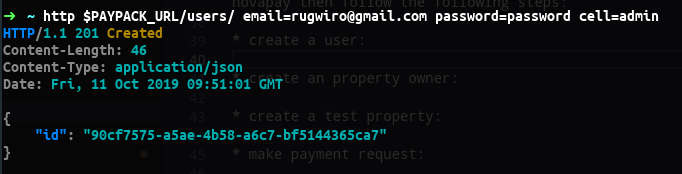
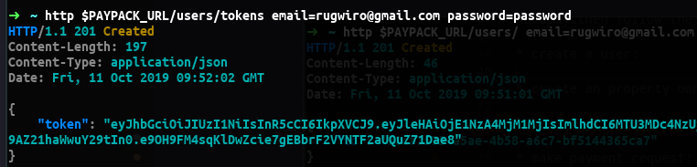
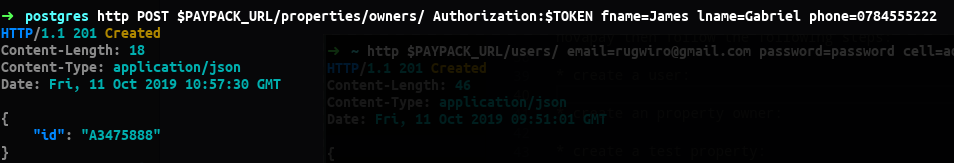
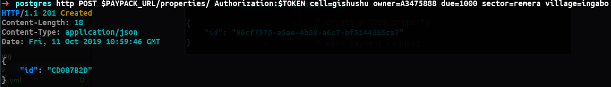
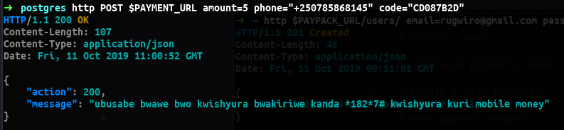

# instructions

The following are instructions to run an instance of paypack outside a container

## database

First you need a database instance and to create one follow these instructions.

    ```
    $ cd tmp
    $ docker-compose up -d
    ```
The above creates a postgres instance running inside a docker container of the name home_db

## build and run paypack

For this step you need to have go installed(version go1.12.9)

1. build paypack buy running `$ make build` from the root of the repository which outputs a binary bin/paypack

2. to export the your environment create a new file .env.test and copy all the variables from .env but this time add export before each then source .env.test.

    example:

    ```
    $ export PAYPACK_DB_HOST=localhost
    ```

3. to run paypack go the root of the repo and:

   ```
    $ ./bin/paypack
    ```

## testing payment

First run the inlets script so that the paypack server can receive confirmation requests from novapay then follow the following steps:

* **create a user**:

<p align="left"></p>


* **login**:

<p align="left"></p>

* **create an property owner**:

<p align="left"></p>

* **create a test property**:

<p align="left"></p>

* **make payment request**:

<p align="left"></p>
